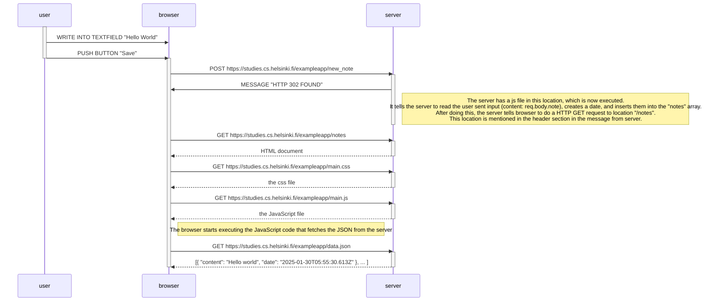

```mermaid

sequenceDiagram
    participant user
    participant browser
    participant server
    activate user
    user->>browser: WRITE INTO TEXTFIELD "Hello World"
    user->>browser: PUSH BUTTON "Save"
    deactivate user
    activate browser

    browser->>server: POST https://studies.cs.helsinki.fi/exampleapp/new_note
    activate server
    server->>browser: MESSAGE "HTTP 302 FOUND"
    Note right of server: The server has a js file in this location, which is now executed.<br>It tells the server to read the user sent input (content: req.body.note), creates a date, and inserts them into the "notes" array.<br>After doing this, the server tells browser to do a HTTP GET request to location "/notes".<br>This location is mentioned in the header section in the message from server.
    deactivate server

    browser->>server: GET https://studies.cs.helsinki.fi/exampleapp/notes
    activate server
    server-->>browser: HTML document
    deactivate server
    
    browser->>server: GET https://studies.cs.helsinki.fi/exampleapp/main.css
    activate server
    server-->>browser: the css file
    deactivate server
    
    browser->>server: GET https://studies.cs.helsinki.fi/exampleapp/main.js
    activate server
    server-->>browser: the JavaScript file
    deactivate server

    Note right of browser: The browser starts executing the JavaScript code that fetches the JSON from the server
    
    browser->>server: GET https://studies.cs.helsinki.fi/exampleapp/data.json
    activate server
    server-->>browser: [{ "content": "Hello world", "date": "2025-01-30T05:55:30.613Z" }, ... ]
    deactivate server    
   
    deactivate browser
    
```

