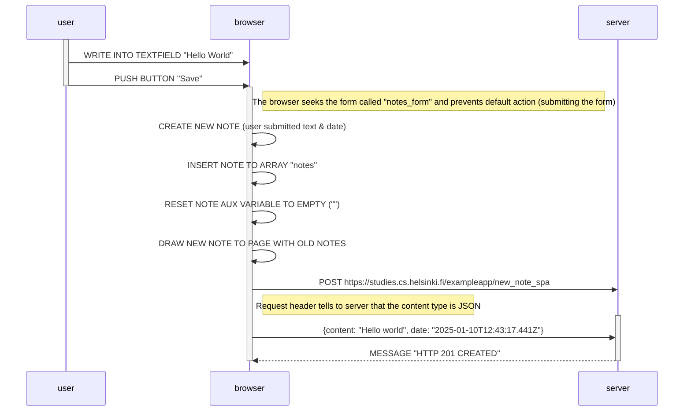

```mermaid

sequenceDiagram
    participant user
    participant browser
    participant server
    activate user
    user->>browser: WRITE INTO TEXTFIELD "Hello World"
    user->>browser: PUSH BUTTON "Save"
    deactivate user
    activate browser
    Note right of browser: The browser seeks the form called "notes_form" and prevents default action (submitting the form)
    browser->>browser: CREATE NEW NOTE (user submitted text & date)
    browser->>browser: INSERT NOTE TO ARRAY "notes"
    browser->>browser: RESET NOTE AUX VARIABLE TO EMPTY ("")
    browser->>browser: DRAW NEW NOTE TO PAGE WITH OLD NOTES
    browser->>server: POST https://studies.cs.helsinki.fi/exampleapp/new_note_spa
    Note right of browser: Request header tells to server that the content type is JSON
    activate server
    browser->>server: {content: "Hello world", date: "2025-01-10T12:43:17.441Z"}
    server-->>browser: MESSAGE "HTTP 201 CREATED"
    deactivate server
    deactivate browser
    
```

